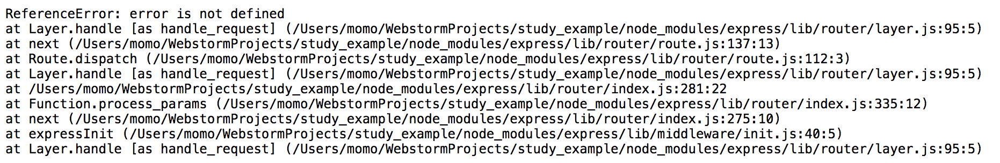

오늘은 nodejs 프레임워크로 많이 사용하는 express의 에러 핸들링에 대해서 정리해 보도록 하자. express에서 어떻게 어플리케이션을 구조화하는지에 대한 가이드를 제공하지 않는다. 그 이유는 어플리케이션의 규모 및 참여하는 팀의 규모에 따라 구조가 달라질 수 있기 때문에, 최대한 유연성을 유지하기 위하여 구조에 대한 전제조건을 배제하려했기 때문이다.
따라서 express를 사용해 보면 Spring이나 Nginx에 비해서 굉장히 자유롭다는 것을 느낄 수 있다. 그렇다면에러 핸들링은 어떻게 해야 할까? 공식 문서를 보더라도 오류 처리에 대한 설명이 매우 간결하다.
정말 별 내용이 없으므로,에러 핸들링을 하면서 궁금했던 몇가지 점이 있었는데, 가이드에선 딱히 제공하지 않으니 직접 예제코드를 만들어 보고 정리해 볼 것이다.

## Basic Usage

먼저 express에서 제공하는 기본적인 에러 핸들링에 대해 알아보도록 하자. express에서 사용하는 다른 미들웨어와 같은 방식으로 에러 핸들러를 등록할 수 있다. 
다만 에러 핸들러는 parameter가 3개가 아닌 4개 (err, req, res, next)를 사용한다.
```js
app.use(function (err, req, res, next) {
console.error(err);
res.status(500).send('Something broke!');
});
```

#### Error Basic
에러 핸들러는 다른 미들웨어와 라우터 호출을 정의한 후 마지막으로 정의해야 한다. 아래와 같이 정의 할 수 있다.
```js
const express = require('express');
let app = express();

// router
app.get('/', function (req, res, next) {
 next('error occur!!');
});

// error handler
app.use(function (err, req, res, next) {
 console.error(err);
 res.status(500).send('Something broke!');
});

app.listen(3000, function () {
 console.log('http://localhost:3000/');
});

```

#### Error Basic Case 01
request가 들어왔을 때 next('error')를 호출하면, 중간에 등록된 미들웨어들은 건너 뛰고 바로 error callback이 실행된다.
```js
const express = require('express');
let app = express();

// middle ware 01
app.use(function (req, res, next) {
 console.log('middle ware 01');
 next('middle ware 01 error occur!!'); // 에러 발생 !!
});

// middle ware 02, skip 됨
app.use(function (req, res, next) {
 console.log('middle ware 02');
 next();
});

// error handler
app.use(function (err, req, res, next) {
 console.error(err);
 res.status(500).send('Something broke!');
});

app.listen(3000, function () {
 console.log('http://localhost:3000/');
});

// result
// middle ware 01
// middle ware 01 error occur!!
```

#### Error Basic Case 02
다수의 에러 핸들러를 등록할 수도 있다. 이 경우에 첫번째 에러 핸들러에서 next를 이용해서 다음 에러 핸들러로 넘겨주어야 한다. 아래 예제를 보자.
logErrorHandler와 requestErrorHander 두 개의 에러 핸들러를 등록하여 사용해 보았다. logErrorHandler는 어떤 에러가 발생했는지에 대해 기록하는 역할을 담당하고, requestErrorHandler는 client에게 에러일 때 응답을 내려주는 역할을 하도록 했다.
이처럼 에러가 발생 했을 때 처리를 나눠서 구조화 할 수 도 있다.
```js
const express = require('express');  
let app = express();

app.use(function (req, res, next) {  
  next('request error');  
});

app.use(logErrorHandler);  
app.use(requestErrorHandler);

function logErrorHandler(err, req, res, next) {
  console.log('logErrorHandler', 'record :', err);
  next(err);
}

function requestErrorHandler(err, req, res, next) {  
  console.error('requestErrorHandler', err);  
  res.status(500).send('send error response');  
}

app.listen(3000, function () {  
  console.log('http://localhost:3000/');  
});

// result  
// logErrorHandler record : request error  
// requestErrorHandler request error
```

#### Error Basic Case 03
한 가지 예외가 있는데 이를 설명하기 전에 아래 예제를 보도록 하자. router handler를 사용하면 하나의 경로에 다수의 route를 등록할 수 있다.
그러나 아래 예제에선 첫번째 route에서 response를 보내주고 있기 때문에 두번째 route는 절대 실행되지 않는다.
```js
router.get('/user/:id', function (req, res, next) {
  console.log('req.params.id', req.params.id);
  next();
}, function (req, res, next) {
  res.send('normal');
});

router.get('/user/:id', function (req, res, next) {
    console.log(req.params.id);
    res.send('special');
});
```

위 내용을 이해하고 다음 내용을 보도록 하자. basic, case01, case02에서 next(error);을 통해 error object를 넘길 수 있다는 것을 알 수 있다.
하지만 예외가 존재하는데 바로 'route'라는 string이다. 다음 예제를 보자. 아래 예제에서는 두개의 route를 등록한 후 'user/:id'로 접근 했을 때, 첫번째 route에서 분기처리를 하고 있다.
'user/0'으로 접근할 경우 next('route');이 호출되고, 이때 에러 핸들러로 이동하는 것이 아니라 다음 router로 이동하게 된다.
그 이유는 next('route'); 때문인데, next에 'route'가 들어올 경우 에러 핸들러로 넘어가는게 아니라 다음 route로 넘어가게 된다.
따라서 'user/0'으로 접근할 경우 special이란 글자를 볼 수 있고, 'user/1' 등으로 접근하면 normal을 볼 수 있다.
에러 핸들러와 사용법이 비슷하므로 기억해두고 사용할 때 주의하도록 하자.
```js
const express = require('express');
let app = express();
let router = express.Router();

router.get('/user/:id', function (req, res, next) {
  if (req.params.id == 0) next('route');
  else next(); //
}, function (req, res, next) {
  res.send('normal');
});

router.get('/user/:id', function (req, res, next) {
  console.log(req.params.id);
  res.send('special');
});

app.use('/', router);

app.listen(3000, function () {
  console.log('http://localhost:3000/');
});
```

## Experiment
만약 에러 핸들러를 중간에 선언하면 어떻게 될까? 맨 처음 예제인 basic에서 error객체 순서를 바꿔보도록 하자.
```js
const express = require('express');
let app = express();

// error handler
app.use(function (err, req, res, next) {
  console.error(err);
  res.status(500).send('Something broke!');
});

// router
app.get('/', function (req, res, next) {
  next('error occur!!');
});

app.listen(3000, function () {
  console.log('http://localhost:3000/');
});

```

자 이제 실행시키고 http://localhost:3000/ 으로 접속해 보도록 하자. 'Something broke!' 가 나왔던 basic예제와 달리 'error occur!!' 가 출력되는 것을 볼 수 있다. 
이는 에러 핸들러를 앞에 등록할 경우엔 제대로 처리되지 않는다는 걸 의미한다. 따라서 error handler를 next(error); 호출 전에 등록하면 기본 오류 핸들러가 실행된다. 
기본 오류 핸들러는 미들웨어 함수 스택 끝에 추가되어 있다. next(error);로 오류를 전달 했는데 해당 오류를 처리하지 못할 경우 기본 오류 핸들러가 처리 하는데 기본적으로는 next로 전달된 parameter를 출력한다.

그 밖에 에러가 발생할 경우에는 기본 오류 핸들러는 Stack Trace도 함께 출력한다. 이는 production mode에서는 실행되지 않으므로 실제 배포할 때에는 NODE_ENV를 production으로 설정해 주도록 하자.


## Practice
자 이제 아래 예제를 보고 어떤 결과가 출력될 것인지 예상해 보도록 하자.
```js
const express = require('express');
let app = express();


// error handler 01
app.use(function (err, req, res, next) {
  console.error('error handler 01', err);
  res.status(500).send('Something broke!');
});

// router
app.get('/', function (req, res, next) {
  next('error occur!!');
});

// error handler 02
app.use(function (err, req, res, next) {
  console.error('error handler 02', err);
  res.status(500).send('Something broke!');
});

// error handler 03
app.use(function (err, req, res, next) {
  console.error('error handler 03', err);
  res.status(500).send('Something broke!');
});

app.listen(3000, function () {
  console.log('http://localhost:3000/');
});

```
'error handler 02 error occur!!' 가 출력 된다는것을 예상했으면, 앞의 내용을 제대로 이해 했다고 봐도 좋을 것이다.
첫번째 에러 핸들러는 무시되고, 두번째 에러 핸들러가 실행된다.
세번째 에러 핸들러는 두번째 에러 핸들러에서 next로 전달해 주지 않는 이상 실행되지 않는다는 것을 알 수 있다.

# 마치며
express의 에러 핸들링에 대한 내용을 다루는 책이나 자료에 대해 많이 찾을 수 없어서 한번 정리해 보았다. 사실 없는 다루지 않는 이유야 간단하기도 하고, Official 문서만 봐도 직관적으로 이해하기 쉽기 때문일 것이다. 그러나 간단한 내용이기 때문에 궁금한 내용도 많았다. 
한번 정리해 보니 어떻게 사용해야 할지 감도 잡히고, 구조 잡을때에도 도움이 많이 될 것 같다. 제일 처음 언급했듯이 express는 보다 자유롭게 구조를 만들 수 있도록 설계가 되어있다. 아는 만큼 보이기 때문에 이번 포스팅을 통해 다음엔 좀 더 쉽고 간편한 에러 핸들링을 할 수 있지 않을까 한다.

