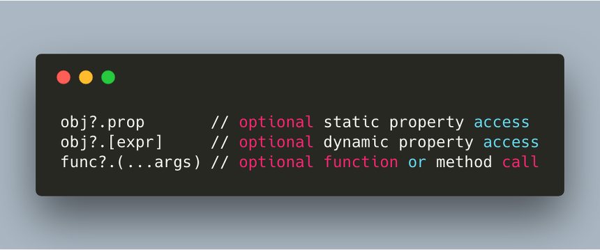

ES2015가 나온지 꽤 오랜 시간이 지났다. function-bind, rest spread, decorator 등 개발을 편하게 도와주는 문법들이 정의되면서 개발을 하는데 한층 더 수월해지는 것 같다. 오늘은 최근 개발하면서 사용하기 도입하기 시작한 꿀같은 기능. Optional Chaining에 대해서 정리해 보고자 한다.

## Optional Chaining?
**Optional Chaining**. 말 그대로 특정 값에 대한 참조에 대해서 값이 존재하지 않을 때 선택적으로 체이닝 할 수 있는 문법이다. 이 문법은 _C#의 conditional operator, Swift의 Optional Chaining_, 또 _CoffeeScript의 Existential operator_와 매우 유사하다. 다른 언어들에서도 유사한 문법이 제공되는 것으로 미루어 보아, 존재하지 않는 값에 대한 예외처리는 언제나 고민의 대상이 되어 왔다는 것을 알 수 있다. 특히나 Object의 참조가 많이 이루어지는 Javascript에서는 객체의 프로퍼티가 존재하는지에 대한 체크가 필수적이다.

Javascript에서 객체의 프로퍼티를 체크하는 방법에는 여러가지가 존재하지만 보통 아래와 같은 방법을 자주 사용할 것이다.

```js
const obj = {
    profile: {}
};

if(obj.hasOwnProperty('profile')){
    obj.profile.name = 'laplace';
}

console.log(obj.profile.name); // laplace
```

obj의 프로퍼티중 profile이 존재하는지 체크하는 로직이다. 자바스크립트는 런타임에 프로퍼티를 체크하게되므로, 만약 profile이 없는 상태에서 name에 접근하려 한다면 TypeError: Cannot set property 'name' of undefined 라는 스크립트 에러가 발생하게 된다. 따라서 중요한 비지니스 로직에는 프로퍼티의 존재 유무를 체크하는 방어적인 로직을 필수적으로 넣는다.

```js
const obj = {};
obj.profile.name = 'laplace';

console.log(obj.profile.name); // Cannot set property 'name' of undefined
```
서버에서 주는 API의 리턴 값이 오브젝트라면, 프로퍼티 값이 null/undefined인 경우를 방지하기 위해 아래와 같이 사용해본 경험도 많을 것이라 생각한다.

```js
const street = user.address && user.address.street;
```
또 querySelector를 사용했을 때 Element가 없는 경우는 다음과 같이 많이 사용했을 것이다.

```js
var fooInput = myForm.querySelector('input[name=foo]');
var fooValue = fooInput ? fooInput.value : undefined;
```
이와 같이 존재하지 않는 프로퍼티에 대한 처리를 하기 위해, 분기코드가 들어가게 되고 이는 코드를 읽는데 방해가 되어 가독성이 저하된다. 따라서 이를 개선하기 위해 등장한 문법이 바로 Optional Chaining이다. 현재 TC-39의 proposal 단계에서이며 최근 stage-2 단계까지 도달했다. 현재 @babel/plugin-proposal-optional-chaining을 추가하면 babel을 통해 바로 사용할 수 있다. 도입 배경에 대해서 알아봤으니 이제 어떻게 사용하는지 간략하게 알아보도록 하자.

## Syntax
문법은 굉장히 직관적이다. "?." 을 사용하여 프로퍼티가 존재하는지 유무를 체크할 수 있다. 만약 체크하는게 함수 타입일 경우, null/undefined가 아니라면 함수를 실행시킨다.

```js
obj?.prop       // optional static property access
obj?.[expr]     // optional dynamic property access
func?.(...args) // optional function or method call
```

삼항 연산자를 통해 어떻게 실행하는지 알아보도록 하자.

```js
a?.b;                          // a가 null/undefined라면 undefined, 아니면 a.b를 반환한다.
a == null ? undefined : a.b;

a?.[x];                        // a가 null/undefined라면 undefined, 아니면 a[x]를 반환한다.
a == null ? undefined : a[x];

a?.b();                        // a가 null/undefined라면 undefined
a == null ? undefined : a.b(); // a.b가 함수가 아니라면 TypeError를 던진다.
                               // 위 경우가 아니라면 a.b를 실행

a?.();                         // a가 null/undefined라면 undefined
a == null ? undefined : a();   // a가 null/undefined, function이 아닌 경우 TypeError를 던진다.
                               // 위 경우에 해당하지 않을 경우 a를 실행
```

물론 아래와 같이 연속해서 사용도 가능하다.

```js
a?.b[3].c?.(x).d;
a == null ? undefined : a.b[3].c == null ? undefined : a.b[3].c(x).d;
```

---

이번엔 좀더 구체적인 예제를 보도록 하자.

```js
const obj = {
    foo: {
        bar: {
            baz: 100,
        },
    },
};

const baz = obj?.foo?.bar?.baz; // 100

const safe = obj?.qux?.baz; // undefined
```

baz는 obj, bar, baz가 존재한 경우에는 baz의 값을 리턴한다. 이를 Optional Chaining 없이 구현한다고 한다면 다음과 같다. 마치 콜백지옥을 보는 듯하다(...)

```js
const baz = obj && obj.foo && obj.foo.bar && obj.foo.bar.baz;
```

다음은 중첩된 객체의 함수에 접근하는 경우이다.

```js
const obj = {
    foo: {
        bar: {
            baz() {
                return 100;
            },
        },
    },
};

const baz = obj?.foo?.bar?.baz(); // 100

const safe = obj?.qux?.baz();       // undefined
const safe2 = obj?.foo.bar.qux?.(); // undefined

const willThrow = obj?.foo.bar.qux(); // Error: not a function
```

앞서 설명했듯이 체이닝을 모두 체크한후 값이 존재한다면 함수를 실행시킨다. 만약 존재하지 않는 함수를 실행하려고 한다면 에러를 발생시킨다. 마찬가지로 baz가 클래스라면 instance를 리턴하게 된다. 마지막으로 함수에 직접 Optional Chaining을 사용한 경우를 살펴보도록 하자.

test가 함수 타입일 경우 함수를 실행시킨다. 하지만 존재하지 않을 경우엔 undefined가 리턴된다. 그렇다면 실제 Babel은 어떻게 Optional Chaining을 구현할까? 궁금하니 위 예제를 한번 돌려보았다.

```js
"use strict";
var _obj$foo, _obj$foo$bar, obj = {foo: {bar: {baz: 100}}},
baz = null === obj || void 0 === obj || null === (_obj$foo = obj.foo) || void 0 === _obj$foo
|| null === (_obj$foo$bar = _obj$foo.bar) || void 0 === _obj$foo$bar ? void 0 : _obj$foo$bar.baz; // 100
```

모두 비교해보는 코드로 바꾸어준다(...) 아무튼 우리는 Optional Chaining을 통해 적은 노력으로 이러한 코드 작성 비용을 줄이고, 높은 가독성도 함께 얻을 수 있다. 사용해보면 생각보다 꽤 생산성을 높일 수 있는 좋은 문법이니 공식적으로 브라우저에서 지원 될 날을 기대해 본다.

#### Reference

-   [TC-39 Proposal Optional Chaining](https://github.com/tc39/proposal-optional-chaining)
-   [@babel/proposal-optional-chaining](https://babeljs.io/docs/en/next/babel-plugin-proposal-optional-chaining.html)