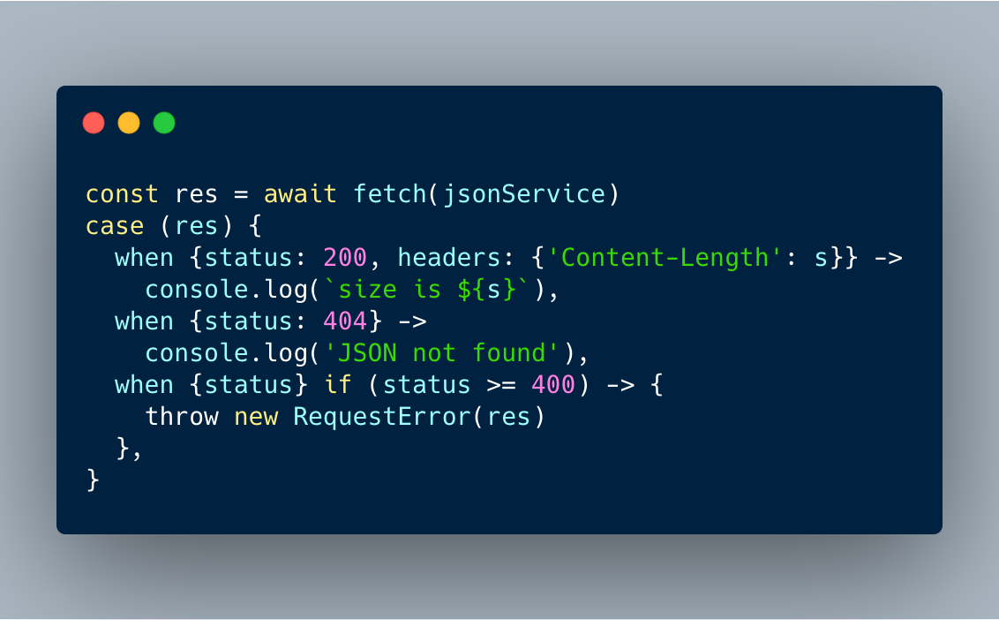

TC-39 Github에 **패턴 매칭(Parttern-Matching)**이 Stage 0에서 1로 한단계 등급이 상향됬었다. Stage1은 proposal 단계로 앞으로 TC-39 위원회에서 논의할 예정이며, 구체적인 데모에 대한 코드도 포함되어야 한다. 아직 Stage2(draft)와 Stage3(candidate), 그리고 stage4(finished)를 거쳐 정식으로 스펙에 추가되려면 갈 길이 멀지만 어떤 기능을 가지고 있고 또 어떻게 사용할 수 있는지 간단하게나마 미리 알아보도록 하자.

패턴 매칭은 Scala, F#, Rust 등 다른 언어에도 있는 기능인데, 앞서 언급한 언어에 대해서는 잘 모르지만, 비교적 단순하므로 다른 언어를 통해 알아보도록 하자.

#### Scala
```c
object MatchTest1 extends App {
  def matchTest(x: Int): String = x match {
    case 1 => "one"
    case 2 => "two"
    case _ => "many"
  }
  println(matchTest(3))
}
```
case명령문을 포함하고 있는 블록은 정수를 문자열로 매핑하는 함수를 정의한다.match라는 키워드를 사용해서 x의 값이 1이 들어올 경우 "one", 2가 들어올 경우 "two", 그 외 값이들어올 경우는 "many"를 반환한다.

#### Rust
```rust
match x {
    1 => println!("one"),
    2 => println!("two"),
    3 => println!("three"),
    _ => println!("anything"),
}
```
Rust도 크게 차이는 없다. 물론 | operator라던가 struct도 패턴 매칭이 가능하다.

```rust
let x = 1;

match x {
    1 | 2 => println!("one or two"),
    3 => println!("three"),
    _ => println!("anything"),
}
```

```rust
struct Point {
    x: i32,
    y: i32,
}

let origin = Point { x: 0, y: 0 };

match origin {
    Point { x, y } => println!("({},{})", x, y),
}
```

여기까지만 본다믄 Switch-Case와 비슷하게 보이는데, 패턴 매칭은 그 쓰임새가 더 용이하다. 아래는 TC-39에서 제안된 패턴매칭의 예제이다. case, when 그리고 if를 사용해서 직관적으로 컨디션 처리를 할 수 있다. 또 적절하게 [구조 분해 할당(Destructuring)](https://developer.mozilla.org/ko/docs/Web/JavaScript/Reference/Operators/Destructuring_assignment)을 사용한 것을 볼 수 있다.
```js
const res = await fetch(jsonService)
case (res) {
  when {status: 200, headers: {'Content-Length': s}} ->
    console.log(`size is ${s}`),
  when {status: 404} ->
    console.log('JSON not found'),
  when {status} if (status >= 400) -> {
    throw new RequestError(res)
  },
}
```

자바스크립트를 이용하여 서버와 통신할 때, 서버의 응답 값에 따라 어떤 결과처리를 할 때가 종종 있다. 보통 이때 if문이나 Switch-Case를 사용해서 분기처리를 하지만 복잡한 컨디션의 경우 코드가 매우 복잡해진다. 하지만 제안된 패턴매칭 방법을 사용하면 비교적 명료하고 간단하게 처리가 가능하다. 만약 독자가 React를 사용하고 있다면 Redux의 리듀서를 작성하는데도 활용 할 수 있다.

#### Reducer

```js
function todoApp(state = initialState, action) {
  switch (action.type) {
    case SET_VISIBILITY_FILTER:
      return Object.assign({}, state, {
        visibilityFilter: action.filter
      })
    case ADD_TODO:
      return Object.assign({}, state, {
        todos: [
          ...state.todos,
          {
            text: action.text,
            completed: false
          }
        ]
      })
    case TOGGLE_TODO:
      return Object.assign({}, state, {
        todos: state.todos.map((todo, index) => {
          if (index === action.index) {
            return Object.assign({}, todo, {
              completed: !todo.completed
            })
          }
          return todo
        })
      })
    default:
      return state
  }
}
```

#### Reducer with pattern matching
```js
function todoApp (state = initialState, action) {
  return case (action) {
    when {type: 'set-visibility-filter', filter: visFilter} ->
      ({...state, visFilter}),
    when {type: 'add-todo', text} ->
      ({...state, todos: [...state.todos, {text}]}),
    when {type: 'toggle-todo', index} -> (
      {
        ...state,
        todos: state.todos.map((todo, idx) => idx === index
          ? {...todo, done: !todo.done}
          : todo
        )
      }
    )
    when _ -> state // ignore unknown actions
  }
}
```

또 자바스크랩트 내에서만 한정하지 않고, JSX안에도 다음과 같이 활용할 수 있다.
```js
<Fetch url={API_URL}>{
  props => case (props) {
    when {loading} -> <Loading />
    when {error} -> <Error error={error} />
    when {data} -> <Page data={data} />
  }
}
</Fetch>
```

마지막으로 함수 덕 타이핑(duck-typing)에도 활용이 가능하니, 익숙해진다면 다양한 곳에 활용할 수 있을 듯 하다.
```js
const getLength = vector => case (vector) {
  when { x, y, z } -> Math.sqrt(x ** 2 + y ** 2 + z ** 2)
  when { x, y } -> Math.sqrt(x ** 2 + y ** 2)
  when [...etc] -> vector.length
}
getLength({x: 1, y: 2, z: 3}) // 3.74165
```

## 마치며
물론, 현재는 Stage1 단계라 추후 API 명세가 크게 바뀔 가능성도 있다(Stage0에서는 없었던 when이 생겼던 것처럼). 현재 바벨에도 추가하려는 움직임이 보이고 있으니 생각보다 우리가 빠르게 접하게 될 것이라 생각한다([#9010](https://github.com/babel/babel/pull/9010)), ([#9318](https://github.com/babel/babel/pull/9318)). 개인적으로 [Optional Chaining](https://dev-momo.tistory.com/entry/Javascript-Optional-Chaining)과 더불어 어서 추가됬으면 좋겠다는 생각이 든다. 참고로 패턴 매칭을 개념을 이용한 유틸 함수들은 이미 많이 만들어져 활용되고 있으므로, 시간이 된다면 직접 만들어서 활용해 보면 좋을 것 같다.