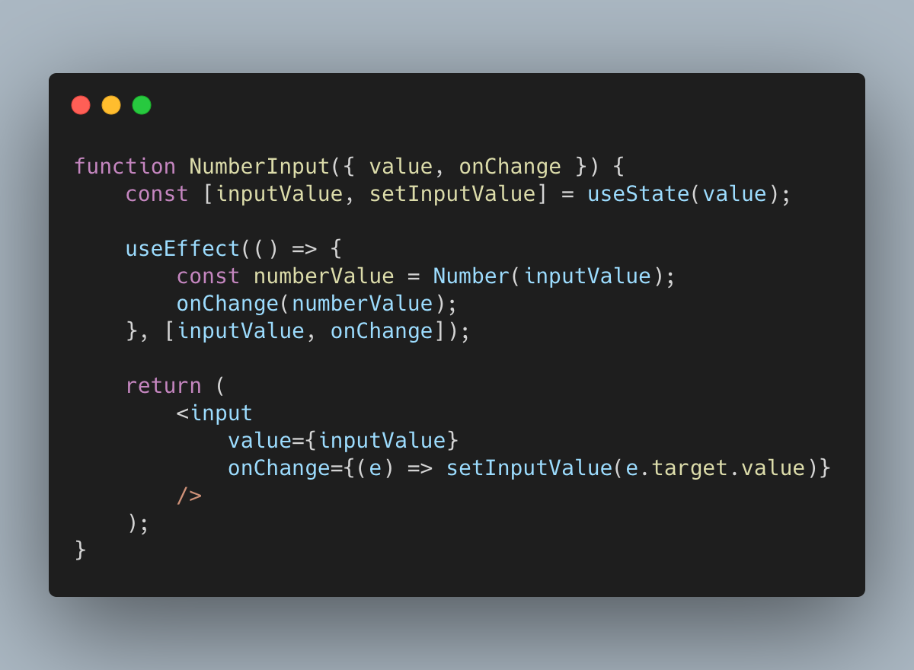

얼마전에 부모 컴포넌트로부터 받은 `props`를 자식 컴포넌트의 `state`에 저장해서 쓰는 형태로 컴포넌트 디자인을 한 적이 있었다.
그런데 코드 리뷰에서 동료 개발자분이 `Derived State`에 대한 부분을 지적해 주셨는데, 사실 몇달 전에도 같은 이유로 고민한 적이 있었다.
또 이렇게 짠 코드를 보며, 혹시 자주 실수하기 쉬운 부분이지 않을까 하는 생각이 들어 이번에는 기록으로 남겨본다.

## Derived State ?

먼저 `Derived State`란 용어가 의미하는 것이 무엇인지 알아야 한다. 
일단 공식 문서의 튜토리얼에서 명확한 개념 설명을 찾기가 힘들었다. 따라서 여기서는 다른 방법을 통해 용어에 대해 탐구해 보도록 하자.
요즘은 React 컴포넌트를 함수형 컴포넌트로 많이 작성을 하는데, 과거 훅(hook)이 나오기 전까지는 클래스형 컴포넌트를 주로 사용하던 시절이 있었다. 
클래스형 컴포넌트에는 생명 주기(Lifecycle) 매서드들이 존재하는데, 그 중에 `componentWillReceiveProps`란 함수가 있었다.
추후 이 메서드는 React v16.13.0에서 `getDerivedStateFromProps`로 대체되는데 여기서 `DerivedState`란 용어가 처음 등장한다.

`getDerivedStateFromProps`는 문자 그대로 `props`가 `state`에 의존하는 아주 드문 경우를 위해 존재하는데, 컴포넌트를 만들다 보면 이렇게 디자인 하는 경우가
종종 있다. 
- [Updating state based on props](https://ko.reactjs.org/blog/2018/03/27/update-on-async-rendering.html#updating-state-based-on-props)
- [Fetching external data when props change](https://ko.reactjs.org/blog/2018/03/27/update-on-async-rendering.html#fetching-external-data-when-props-change)

하지만 대부분의 경우 이런 패턴으로 컴포넌트를 만들 때 코드가 장황해지고, 컴포넌트의 상태 변화를 이해하기가 어려워 진다. 따라서 React 공식 문서에서도 해당 패턴으로 컴포넌트를
만드는 것을 지양하도록 안내하고 있다. 아무튼 해당 메서드 이름을 통해 `Derived State`의 의미를 파악해 보자면, `props`와 의존성이 존재하는 `state` 정도로 이해하면 문제가 없을 것이다.

## Derived State는 어떤 문제가 있나?

언뜻 보면, props를 state에 받아서 사용하는데 어떤 문제가 발생하나 직관적으로 잘 이해가 되지 않을 수 있다. 이럴 땐 예제를 보며 이해해 보도록 하자.
Dan Abramov가 작성한 [Writing Resilient Components](https://overreacted.io/writing-resilient-components/)의 예제 코드를 살짝 빌려 작성 했다.

여기에 버튼 컴포넌트가 있다.
```js
// isOk는 state
<Button color={isOk ? 'blue' : 'red'} />
```

버튼 컴포넌트는 color를 받아 클래스를 변경함으로써 버튼의 색깔을 바꿔준다.
```js
function Button({ color, children }) {
  return (
      // ✅ `color` 값이 항상 반영 됨
    <button className={'Button-' + color}>
      {children}
    </button>
  );
}
```

하지만 `Derived State`로 만든다면 어떨까?
```js
class Button extends React.Component {
    state = {
        color: this.props.color
    };
    render() {
        const { color } = this.state; // 🔴 `color` 가 변하지 않음
        return (
            <button className={'Button-' + color}>
                {this.props.children}
            </button>
        );
    }
}
```
버튼 컴포넌트의 state에 props.color가 할당된다. 하지만 당연하게도 color props가 변경되어도, state에는 처음 마운트될 때 한번만 할당되기 때문에 원하는대로 동작하지 않는다.
```js
// 🔴 더 이상 isOk 상태에 따라 색깔이 변하지 않음
<Button color={isOk ? 'blue' : 'red'} />
```

이 예제만 보면, 굉장히 기초적인 내용이고 실수할 여지가 있을까? 하는 생각이 들것이다. 
심지어 이 내용은 [React 공식 문서](https://reactjs.org/docs/react-component.html#constructor)에도 다루고 있는 내용이다. 
그럼 어떤 경우에 실수할 가능성이 있을까?

## Derived State를 사용하는 경우
개인적으로 내부에서 상태를 정의하여, 외부로 상태를 가공하여 내보내는 컴포넌트를 만들때 자주 사용한다. 보통 useEffect + onChange를 조합하는 패턴을 많이 사용할 것이다.
아래 [예제 코드](https://codesandbox.io/s/review-react-derived-state-1-o9jy6?file=/src/App.js)를 보자.
```js
import { useState, useEffect } from "react";

export default function App() {
    const [value, setValue] = useState(0);

    return (
        <div>
            <NumberInput value={value} onChange={setValue} />
        </div>
    );
}

function NumberInput({ value, onChange }) {
    const [inputValue, setInputValue] = useState(value);

    useEffect(() => {
        const numberValue = Number(inputValue);
        onChange(numberValue);
    }, [inputValue, onChange]);

    return (
        <input
            value={inputValue}
            onChange={(e) => setInputValue(e.target.value)}
        />
    );
}
```
`<NumberInput />`은 입력한 데이터를 `Number` 형태로 바꿔서 외부 상태에 전달하는 컴포넌트이다. 이 컴포넌트는 잘 동작하는 것처럼 보이지만 두가지 문제점이 존재한다.
1. source of truth가 존재하지 않는다. App에도 value에 대한 상태가 존재하고, `<NumberInput />`의 내부에도 value에 대한 상태가 존재한다. 두개의 상태를 가지고 있기 때문에 의도하지 않은 버그를 발생시킬 가능성도 많고 코드도 복잡해졌다.
2. value의 값을 통해 상태를 제어할 수 없다. React 컴포넌트는 크게 `props`와 `state`가 변함에 따라 컴포넌트의 랜더링 결과가 달라질 것이라 예상한다. 하지만 `Derived State`로 구현된 경우에는 value를 바꿔도 `<NumberInput />`의 값을 바꿀 수 없다. 위 코드에 버튼을 추가하여 value의 값을 변경시켜 보자. ([예제 코드](https://codesandbox.io/s/review-react-derived-state-2-8mf2y?file=/src/App.js))
```js
export default function App() {
    const [value, setValue] = useState(0);

    return (
        <div>
            <NumberInput value={value} onChange={setValue} />
            <button onClick={() => setValue(10)}>10으로 변경</button>
        </div>
    );
}
```
버튼을 아무리 눌러도, input의 값이 10로 변하지 않는 것을 확인할 수 있다.

## 개선 방법
여러가지 방법이 있지만, 크게 두가지 패턴을 추천한다.

#### Fully Controlled Component
첫번째 방법은 내부 상태를 가지지 않는 컴포넌트로 만드는 것이다. 이 패턴을 사용하면 하나의 상태를 참조하기 때문에, 코드가 간결해지고 이해하기 쉬워진다. ([예제 코드](https://codesandbox.io/s/review-react-derived-state-3-8qub3?file=/src/App.js))

```js
function NumberInput({ value, onChange }) {
    return (
        <input
            value={value.toString()}
            onChange={(e) => onChange(Number(e.target.value))}
        />
    );
}
```

#### Fully Uncontrolled Component + Key 
두번째 방법은 `key`를 이용하는 것이다. React는 `key props`룰 이용하여 컴포넌트를 다시 그릴지 재활용 할지(Reconciliation)를 결정한다. 따라서 부모 컴포넌트의 상태가 변할 경우 `key`값을 바꿔서 컴포넌트가 다시 그려지도록 구현한다. ([예제 코드](https://codesandbox.io/s/review-react-derived-state-4-zl1kc?file=/src/App.js))
물론 다시 랜더링 되는 것 때문에 성능에 대해 걱정될 것이다. 하지만 `Derived State`를 사용하는 경우, 대게 복잡하고 무거운 로직을 내부에 들고있는 경우가 많기 때문에, 대게의 경우 성능 차이는 미미하다고 볼 수 있다. 공식 문서에서도 다음과 같은 문구를 찾아볼 수 있다.

> While this may sound slow, the performance difference is usually insignificant. Using a key can even be faster if the components have heavy logic that runs on updates since diffing gets bypassed for that subtree.

또, 이 경우에 `Derived State`에 전달되는 `props`는 처음 마운트될 때 한번만 초기화되므로, 보통 `default` 나 `initial`같은 접두어(Prefix) 많이 사용한다. `Derived State`로 구현된 라이브러리들을 찾아보면, 실제 이런 접두어를 많이 사용해서 구현한 것을 심심치 않게 발견할 수 있다. 

```js
import { useState, useEffect } from "react";

export default function App() {
  const [value, setValue] = useState(0);
  
  return (
    <div>
      <NumberInput defaultValue={value} onChange={setValue} key={value} />
      <button onClick={() => setValue(10)}>10으로 변경</button>
    </div>
  );
}

function NumberInput({ defaultValue, onChange }) {
  const [inputValue, setInputValue] = useState(defaultValue);

  useEffect(() => {
    const numberValue = Number(inputValue);
    onChange(numberValue);
  }, [inputValue, onChange]);

  return (
    <input value={inputValue} onChange={(e) => setInputValue(e.target.value)} />
  );
}
```

`<NumberInput />`은 이러한 패턴을 보여주기 위해, 최소한의 기능만을 이용해 구현해 본 예제이다. (여기서는 다시 랜더링 되기 때문에, 숫자를 입력할 때마다 성능 이슈가 발생한다.)
실제 우리가 개발해서 사용하는 컴포넌트들은 이보다 더 복잡하고 다양한 상태를 다룰 것이다. 때문에 `Derived State`에 대해 한번 학습하여 삽질을 조금이나마 줄였으면 하는 바램이다. 


## 마치며
글로 정리해보니 많이 명확해졌다. 사실 위 내용은 리액트 공식문서나 유명 개발자의 블로그에서 종종 찾아볼 수 있는 내용이다. 
하지만 깊게 다뤄지지 않는 부분이기 때문에 종종 실수할 수 있는 개념이라 생각한다. 
해당 내용을 공부하면서 오랜만에 클래스형 컴포넌트도 다시 찾아보고, 이런 방법을 생각해낸 선구자들의 고민을 엿볼 수 있어서 재미있었다.
마지막으로 같이 읽어보면 좋을 포스트 2개를 레퍼런스에 추천해 보며 기록을 마친다.

## Reference
- [You Probably Don't Need Derived State](https://reactjs.org/blog/2018/06/07/you-probably-dont-need-derived-state.html)
- [Writing Resilient Components](https://overreacted.io/writing-resilient-components))