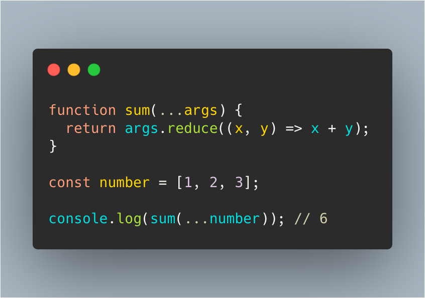

전개 구문(Spread Syntax)와 Rest Parameter를 딱히 구분해서 공부하진 않았는데, 확실하게 기억해 두지 않으니 사용할때마다 헷갈린다. 이번 기회에 확실하게 정리해 두도록 하자.

#### **Spread Syntax**
전개 구문은 반복 가능한 배열, 문자열 또는 이터러블에 대해서 사용이 가능하다. 

```js
function sum(x, y, z) {
  return x + y + z;
}

const numbers = [1, 2, 3];

console.log(sum(...numbers)); // 6
```

위 예제와 같이 함수의 파라미터로 넘길 때 "..."를 사용하여 넘기면 내부적으로 풀어서 인자를 전달 해준다.

```js
const numbers = [1, 2, 3];
const num = [...numbers, 'four', 'five', 'six'];
// [1, 2, 3, "four", "five", "six"]
```

배열 안에서 사용한다면 push나 concat을 사용하는 것보다 간결하게 사용할 수 있다.

```js
const foo = { x: 1};
const bar = { y: 2};
const foobar = {...foo, ...bar}; // {x: 1 , y: 2}
```

물론 object에도 사용이 가능하다. 마찬가지로 ...를 사용하여 object를 복사할 수 있다.

#### **Rest Parameter**
Rest Parameter는 넘어온 arguments를 자바스크립트 배열로 바꿔준다. 아래 1, 2, 3으로 넘어온 인자들은 "..."연산자를 통해 \[1, 2, 3\]으로 변환해준다. 기본적으로 arguments로 넘어온 값은 유사배열로 동작하기 때문에, map, filter, reduce 등 배열의 메서드들을 사용할 수 없어서 한번 더 변환하는 작업을 해줬어야 했다. Rest Parameter를 사용하면 번거롭게 변경할 필요가 없다.

```js
function sum(...args) {
  return args.reduce((x, y) => x + y);
}

console.log(sum(1, 2, 3)); // 6
```
기본적으로 arguments로 넘어온 값은 유사배열로 동작하기 때문에, map, filter, reduce 등 배열의 메서드들을 사용할 수 없어서 한번 더 변환하는 작업을 해줬어야 했다. Rest Parameter를 사용하면 번거롭게 변경할 필요가 없다.

#### **Mixed**
```js
function sum(...args) {
  return args.reduce((x, y) => x + y);
}

const number = [1, 2, 3];

console.log(sum(...number)); // 6
```

위 예제는 두 문법을 혼용해서 사용해 보있다. 둘의 문법이 둘다 "..."를 사용하기 때문에 개념을 익숙한 사람도 혼동할 수 있다. 앞으로는 헷갈리지 않게 개념을 잘 익혀두도록 하자.