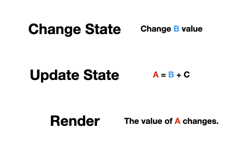

작년에 사내 컨퍼런스에서 React를 주제로 발표를 한 적이 있는데, 시간이 조금 지났지만 그때 발표했던 내용을 글로 적어보고자 한다.

모든 도구에는 그것을 만든 이유가 있기 마련이고, 인간이 만든 물건에는 왜 그 물건을 만들게 되었는지, 고민한 지혜와 원리가 담겨 있다.
당연하게도 이 생각은 프로그래밍 언어나 라이브러리, 프레임워크에도 적용이 될 수 있는데, 한 단어로 표현하면 철학(philosophy)이라고 부를 수 있을 것 같다.
철학은 "왜?"라는 질문을 던지는 것으로부터 시작한다. 조금 더 자세히 말하면, "왜?"라는 질문의 합리적 대답을 찾아가는 과정으로부터 시작된다고 볼 수 있다.

사실 무언가를 공부할 때 "왜?"라는 질문은 매우 효율적이다. 왜 이것을 만들었는지, 왜 이것을 사용하는지에 대해서 인지하는 것은, 활용성에 있어서 큰 차이가 나타난다는 것을 우리는 이미 경험적으로 알고있다.
따라서 이번 글에서는 React에 대해서 "왜?"라는 질물은 통해 철학적으로 접근해 보고, 어떻게 사용하면 좋을지 나름대로 탐구해 본다.

그럼 React의 어느 부분에 "왜?"라고 질문을 던져 보아야 할까? 어떻게 접근해야 할지 여러모로 고민이 많이 될텐데, 고민이 많을수록 심플하게 접근해보자.

"왜 이름이 React 일까?"

### React 이름의 유래

React라는 이름은 누가 붙였을까? 왜 React라고 이름을 붙였을까? 여러모로 혼자 추론을 해보았는데, 고민 해결의 가장 좋은 방법은 만든 사람에게 물어보는 것이라
생각했다. 그래서 물어봤다. [#14606](https://github.com/facebook/react/issues/14606)

여러 답변이 많았는데, "chemical reactions,즉 화학 반응에 영감을 받아 지어졌다, 그래서 로고가 원자 모형이다." 라는 답변이 재미있었다.
고맙게도 내가 좋아하는 개발자인 Dan Abramov도 의견을 남겨 주었다. 스레드 중간에 이름의 유래에 대한
단서를 제공하는 [포스트 링크](https://reactjs.org/blog/2016/09/28/our-first-50000-stars.html#fbolt-is-born)를 남겨주어서, 해당 포스트를 자세히 읽어보았다.

위 내용을 간략하게 요약해보면, FBlot라 불리던 초기 라이브러리는 API가 모든 상태 또는 속성의 변화에 따라 반응하며, 어떤 형태의 데이터와도 잘 동작하기 때문에 React라는 이름이 적합하다고 생각했다 한다.
또 반응성(reactivity)이라는 단어를 사용하는데, 우리는 이와 비슷한 단어를 들어본 적이 있다. 바로 리엑티브 프로그래밍(Reactive Programming)이다.

### React와 Reactive Programming

React와 Reactive 프로그래밍은 관련이 있을까? 여기서부터는 순전히 뇌피셜이기 때문에 가볍게 재미로 읽어보길 바란다. 먼저 리엑티브 프로그래밍에 대해서 간단히 알아보자.
리엑티브 프로그래밍의 철학을 한마디로 정리해 보면, 비동기 데이터의 흐름을 다루는 프로그래밍 패러다임 정도로 정의할 수 있다. 글로 읽으면 잘 이해가 되지 않으니, 간단한 예제를 보도록하자.

비동기 데이터 흐름엔 뭐가 있을까? 대표적으로 클릭 이벤트로 생각해보자. 우리가 버튼을 클릭하면 위 그림의 Click Stream처럼, 클릭 이벤트가 연속적으로 계속 들어올 것이다.
Click Stream은 클릭 이벤트를 시간의 흐름에 따라 길에 늘어뜨려 놓은 것이라 생각하면 좀 더 이해하기가 쉬울 것이다.

그럼 여기서 특정 시간동안 특정 횟수이상 클릭된 데이터를 추출하려면 어떻게 하면 될까? 먼저 무수한 이벤트 데이터들 중에서, 클릭 이벤트가 발생하는지 계속 관찰해야 할 것이다.
그러다 클릭 이벤트가 발생한다면? 그 이벤트에 대해서 무언가 처리를 해주면 되지 않을까?
위 그림의 buffer(clickStream.throttle(250ms))함수는 250ms 이벤트 침묵 이 발생하면 클릭을 리스트에 누적시킨다. 이제 누적된 이벤트를 map으로 만들어 길이를 추출한 후, 2회 이상인 것만 필터로 거른다.
이렇게 데이터의 흐름을 관찰하다 값이 변경되거나 충족되면 반영한다. 이처럼 리엑티브 프로그래밍은 비동기적으로 발생하는 이벤트의 흐름을 관찰하며, 필요에 따라 원하는 방식으로 데이터를 가공한다.
그런데 이모습...어디서 많이 본 것 같다.

React에서 리스트를 랜더링 할 때의 모습이다. NumberList에 numbers라는 데이터가 들어온다. 이 데이터를 map을 이용하여 맵핑하고, filter를 이용하여 특정한 숫자만 거를 수도 있다.
뭔가 모양새가 앞에서 설명한 개념이랑 비슷한 것 같기도하고, 아닌 것 같기도하다. 아직 잘 이해되지 않는다. 
다른 방법을 사용해서 접근해 보도록 하자. 비교는 이해를 위한 좋은 수단 중 하나이다. 우리에게 익숙한 절차형(Imperative) 프로그래밍과 한번 비교해 보자.

A에 B와 C를 더한 값을 저장한다. 그 후에 B의 값을 바꾼다고 가정해 보자. 여기서 두 프로그래밍 패러다임에 차이점이 발생한다.
절차형 프로그래밍에서는 A의 값은 결코 변하지 않는다. A는 B+C 연산의 결과물일 뿐이며, A의 값을 변경하는 방법은 오직 B’+C값을 더해 재연산하는 명령을 내리는 수밖에 없다.
그러나 리엑티브 프로그래밍은 앞서 언급한 클릭 이벤트 처럼, 변화를 관찰하고 있다가 변화가 발생하는 순간 특정한 연산을 수행한다. 따라서 B값이 변할 때마다 바로바로 재연산이 수행되어 A값도 함께 바뀌게 된다.
그런데.. 이 모습도 어디선가 본 것 같다.

위 그림은 React에서 State가 변화하는 과정이다. B를 State, A를 랜더링된 결과로 대입해보면, React는 State가 변경되었을 때 이를 관찰하고있다가 랜더링 된 결과를 업데이트 한다. 엄격하게 이야기하면
리엑티브 프로그래밍의 개념과는 사뭇 다르지만, 앞에서 언급한 개념들과 어느정도 일맥 상통하는 부분이 있어보인다. Dan이 코멘트로 남겨준 내용을 바탕으로 볼때, 이 개념이 React라고 불리게 된 것에 큰 영향을 미치지 않았을까 조심스럽게 추측해본다.

### React와 Functional Programming
리엑티브 프로그래밍에 대해 공부하다보면 다음과 같은 단어를 마주하게 된다. Functional Reactive Programming. 줄여서 FRP라고 부르는데, 말 그대로 리엑티브 프로그래밍에 함수형 프로그래밍의 원리를 접목시킨 것이다.
함수형 프로그래밍에서 말하는 순수한 형태의 함수는 부작용(Side-Effect)를 배제하여 예측가능하고 재사용 가능한 코드를 만드는 것을 도와주는데, 이 순수한 함수는 데이터를 흐름으로 처리하는 리엑티브 프로그래밍과 엄청난 시너지를 낸다.
그렇다면 리엑티브 프로그래밍을 닮은 React와는 궁합이 어떨까? 이미 React를 사용하고 있는 당신은, 이 원리를 은연 중에 적용하고 있다.

간단한 예로 Reducer가 있다. Reducer를 사용해 본 사람이라면, Reducer를 작성할 때, 순수 함수로 작성하라는 가이드를 보았을 것이다. 
이는 같은 상태와 액션에 대해 같은 동작을 보장하게 하려는 순수 함수와 같은 의도가 숨어있다. 덕분에 우리는 Reducer들을 조합하여, 복잡한 로직을 예측가능하고 재사용 할 수 있게 설계할 수 있다.
이밖에도 불변성, 고차 함수(를 이용한 고차 컴포넌트) 등 함수형 프로그래밍의 개념이 리엑트에 많이 녹아 있으므로, 어떻게 활용되는지 찾아보는 것도 재미가 솔솔하다.

## 마치며
왜 React라고 이름을 지었을까. 그 해답을 찾아가는 과정은 책을 읽으며 작가의 의도를 파악하고 소통하는 재미와 같았는데, 다른 사람들과도 이 재미를 공유해 보고자 글로 끄적여 보았다.

글을 작성하면서 어떻게 하면, 이런 좋은 코드들을 통해 더 좋은 개발자로 성장할 수 있을까도 고민도 많이 했다.
이것저것 주절주절 떠들며 리엑티브 프로그래밍이 어떠니 함수형 프로그래밍이 어떠니 이야기 했지만, 언급한 내용에 대해 몰라도 코드를 작성하기엔 큰 어려움은 없다. 
사실 이런 개념들을 아는가 모르는가는 크게 중요하지 않은 것 같다.
중요한 것은 그것에 담긴 생각을 이해하려는 노력일 것이다. 서두에서 언급했듯이 사람이 만든 무언가에는 철학이 담겨있다.
만든 사람의 철학에 대해서 이해하고 교감하려 노력한다면, 어떻게 활용해야할지 조금 더 쉽게 접근할 수 있고, 앞으로 어떻게 발전해 나갈지에 대해서도 미리 예측해 볼 수 있으리라 생각한다.
분명 만드는 과정에서 엄청나게 많은 고민을 했을 것이고, 그것을 압축한 것이 철학일 테니까.

## Reference
- [The introduction to Reactive Programming you've been missing](https://gist.github.com/staltz/868e7e9bc2a7b8c1f754)
- [MS는 ReactiveX를 왜 만들었을까? (feat. RxJS)](https://huns.me/development/2051)