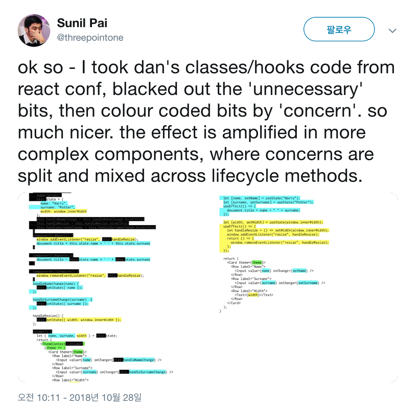

최근 React v16버전으로 업데이트되면서 여러가지 개발 효율성을 높여주는 API들이 추가되고 있다. 최근 회사에서 시작한 스터디에서 이번에 React Conf 2018에서 소개된 Hooks에 대해 공부하기로하여 여기에 정리해 본다.

## Why Hooks ?

어떤 기능에 대해 깊게 이해하고 싶다면, 그 기능이 왜 생겼는지에 대하여 알아보는 것이 가장 좋은 방법이라 생각한다. 따라서 이 글에서는 Hooks을 다루는 API보단 도입 배경에 초점을 맞추도록 하겠다. Hooks 문법을 모르는 사람은 사람은 간단히 [Hooks at a Glance](https://reactjs.org/docs/hooks-overview.html)를 읽고 오도록 하자.

다시 돌아와서 Facebook은 React Hooks을 왜 도입되게 되었을까? 사실 공식 문서인 [Intoducing Hooks Motivation](https://reactjs.org/docs/hooks-intro.html#motivation)에 그 이유가 간락하게 소개되어 있다. 약간 아쉬운 감이 있어서 좀더 찾아봤더니 Dan Abramov가 쓴 [Making Sense of React Hooks](https://medium.com/@dan_abramov/making-sense-of-react-hooks-fdbde8803889) 라는 아티클을 발견하게 되었다. 꽤나 자세하고 친철하게 설명하고 있으므로, 해당 아티클에서 왜 Hooks가 도입되었는지에 대해 설명하는 부분에 대해 간략하게 여기에 정리해 보도록 하겠다.

그 이전에 React Hooks에 대한 소개가 있었던 React Conf 2018 동영상을 소개한다. Dan이 직접 라이브 코딩을 통해 Hooks에 대한 핵심을 설명하므로 시간이 된다면 반드시 보는 것을 추천한다.

<iframe width="560" height="315" src="https://www.youtube.com/embed/dpw9EHDh2bM" frameborder="0" allow="accelerometer; autoplay; encrypted-media; gyroscope; picture-in-picture" allowfullscreen></iframe>

여기서 부터는 위 동영상과 아티클을 바탕으로 필자의 주관이 다소 관여되어 있으므로 감안해서 읽도록 하자. 내가 생각하는 Hooks이 도입된 이유는 크게 세가지이다. **Huge and Complex Componets**, **Duplicated Logic**, 그리고 **Class**이다.

## Huge and Complex Components

부작용(Side-Effect)없이 프로그래밍 하는 좋은 방법 중 하나는 커다란 코드를 작은 단위로 쪼개서 작성하는 것이다. 작게 나눠서 해결하기 위해 우리는 주로 함수나 클래스를 사용하기도 하고, React에서는 컴포넌트라는 개념을 이용하여 문제를 잘게 쪼개기도 한다. React의 컴포넌트 활용법에 대해서는 [Presentational and Container Components](https://medium.com/@dan_abramov/smart-and-dumb-components-7ca2f9a7c7d0)에서 언급한 패턴을 많이 사용하는데, 잘 모르는 사람들을 위해 간략하게 설명하도록 하겠다.

컴포넌트는 크게 2가지 종류로 나눌 수 있는데, **Presentational 컴포넌트**와 **Container 컴포넌트**이다. Presentational 컴포넌트, 즉 보여주는데 초점을 맞춘 이 컴포넌트는 스타일 정보만을 가지며 화면을 그리는데만 집중한다. 이 컴포넌트는 보여주는데 집중하기 때문에 복잡한 비지니스 로직을 가지지 않으므로 state를 가질 필요가 없다. 따라서 함수형 컴포넌트(Functional Component)로 많이 구현을 한다. 반면 Container 컴포넌트는 비지니스 로직을 가지고 있으며, Presentational Component들을 가지고 화면을 그리는 최소한의 스타일 정보만 가지고 있다. 이렇게 컴포넌트의 역할을 분리해 각각 고유한 책임을 부여함으로서 재사용성을 높이고, 디버깅을 쉽게하는데 그 목적이 있다.

여기서 생각해 보자. Presentational 컴포넌트는 외부로부터 필요한 props를 주입받아 그리기 때문에 재사용 하기가 쉽다. 보통 재사용을 많이하는 List Item이나 Button 등을 생각하면 이해가 쉬울 것이다. 그러나 Container 컴포넌트는 state나 비지니스 로직을 가지고 있기 때문에 재사용 하기가 쉽지 않다. state를 재사용하는 방법이 아주 없는 것은 아니다. React가 성숙해지면서 Higher-Order Component나 Render props 같은 패턴들이 나오게 되었고, 이를 이용하면 간편하게 state를 재활용 할 수 있다.

```js
asyncFunction(1, () => {
  asyncFunction(2, () => {
    asyncFunction(3, () => {
      asyncFunction(4, () => {
        asyncFunction(5, () => {
          asyncFunction(6, () => {
            // Do Someting
          });
        });
      });
    });
  });
});
```

그렇다면 state의 재사용성에 대한 문제는 해결된 것인가? 이해를 돕기 위해 우리가 자주 사용하는 Callback을 예로 들어보자. 자바스크립트는 싱글 스레드이기 때문에 이벤트 루프를 이용한 Callback 패턴을 굉장히 자주 사용한다. Callback은 한두번 사용하면 문제가 되지 않지만, 비동기 작업을 하다보면 Callback이 꼬리를 무는 상황을 마주하게 된다. 바로 콜백 지옥(Callback Hell)이다.

마찬가지로 컴포넌트나 state를 재활용하기 위해 HOC를 많이 사용하게 된다면 아래와 Wrapper Hell을 마주할 수도 있다(...)


React Conf 2018 동영상에서 소개된 Wrapper Hell

이렇게 만들어진 거대한 컴포넌트(Huge Component)는 복잡성(Complex)을 증가시켜 디버깅을 어렵게 한다. React Hooks는 이러한 패턴들에게 칼을 들이댄다. useState라는 Hook을 사용하면 state를 재사용 할 수 있게 해줄 뿐만 아니라, 비교적 덜 무거운 함수형 컴포넌트에도 state를 사용할 수 있다.

```js
function Counter({initialCount}) {
  const [count, setCount] = useState(initialCount);
  return (
    <>
      Count: {count}
      <button onClick={() => setCount(0)}>Reset</button>
      <button onClick={() => setCount(prevCount => prevCount + 1)}>+</button>
      <button onClick={() => setCount(prevCount => prevCount - 1)}>-</button>
    </>
  );
}
```

그렇다면 HOC나 Render prop 없이 이런 문제점을 해결할 수 있는 다른 방법은 없었을까? 결론부터 말하자면 이전에도 존재 했었다. 바로 Mixin이다. 과거에도 React에는 Mixin이 있었지만 몇가지 해로운(Harmful)점이 있었기 때문에 제거 되었다. 이에 관해서는 [Mixins Considered Harmful](https://reactjs.org/blog/2016/07/13/mixins-considered-harmful.html#why-mixins-are-broken)에서 자세히 다루고 있으니 꼭 읽어보도록 하자. 결론적으로 페이스북 팀에서는 Mixin을 다시 도입하기 보다는 새로운 API를 만들기로 결정했고, 그렇게 탄생한게 바로 Hooks다.

아래 이미지는 Hooks을 사용하기 전과 후를 비교한 [트위터](https://twitter.com/threepointone/status/1056594421079261185)이다. 왼쪽과 비교해 오른쪽이 재사용하기 쉽게 모듈화 되었고, 가독성도 훨씬 좋아진 것을 알 수 있다.



## Duplicated Logic

Hooks이 도입된 두번째 이유, 그건 바로 **중복 로직** 때문이다. 아래 코드를 보도록 하자. 컴포넌트를 개발하다보면 라이프 사이클에 중복된 로직을 사용하는 경우가 상당히 빈번하다.

```js
class Example extends React.Component {
  constructor(props) {
  super(props);
  this.state = {
    count: 0
  };
  }
  componentDidMount() {
      document.title = `You clicked ${this.state.count} times`;
  }
  componentDidUpdate() {
      document.title = `You clicked ${this.state.count} times`;
  }
  render() {
    return (
      <div>
        <p>You clicked {this.state.count} times</p>
        <button onClick={() => this.setState({ count: this.state.count + 1 })}>
        Click me
        </button>
      </div>
    );
  }
}
```

아래 코드는 componentDidMount와 DidUpdate에 중복된 코드를 hooks의 **useEffect**를 사용해서 통합하는 예제이다. useEffect 함수는 componentDidMount, componentDidUpdate, 그리고 componentWillUnmount를 합친 함수라 생각하면 쉽다.

```jsx
import { useState, useEffect } from 'react';

function Example() {
  const [count, setCount] = useState(0);

  useEffect(() => {
    document.title = `You clicked ${count} times`;
  });
  return (
    <div\>
      <p\>You clicked {count} times</p\>
      <button onClick={() \=> setCount(count + 1)}>
      Click me
      </button>
    </div\>
  );
}
```

간단히 Real World에 바로 적용할 수 있는 부분은 없을까? 데이터가 갱신 됬을 때, 초기화를 해줘야 한다던가 Loading UI를 보여준는 상황 등이 있을 수 있겠다. 아무튼 페이스북 팀은 이러한 중복 로직을 줄이고, 더 적은 부분으로 쪼갤 수 있도록 reducer hook을 추가로 제공하고 있는데, 이 부분에 대해서는 추후 다시 다뤄보도록 하겠다.

## Class

마지막으로 **Class**이다. Class가 왜 문제인지 의문이 드는 사람이 많을 것이다. 정확히는 Class보단 Class안에서 사용하는 this가 문제이다. Javascript에서 this의 동작방식은 다른 언어와 다르기 때문에, 익숙하지 않은 개발자들에겐 어려움이 되기도 한다. 또 컴포넌트 안에서 사용하는 대부분의 함수들은 this를 바인딩 해야 작동하는데 이 부분이 실수의 여지도 많을 뿐더러, 바인딩 작업 때문에 코드가 장황해진다(React Conf 2018에서 Dan도 라이브 코딩중에 이부분을 실수해서 웃음을 자아내기도 했다). 물론 [@babel/plugin-proposal-class-properties](https://babeljs.io/docs/en/babel-plugin-proposal-class-properties)를 사용해서 코드량을 줄일 수는 있지만 React 자체로도 해결할 수 있는 방법을 꾸준히 고민해 왔던 것으로 보인다. 자바스크립트의 함수형 프로그래밍을 다루는 여러 아티클에서 this의 부작용(Side-Effect)을 많이 다루는데, 다른 라이브러리보다 FP 철학이 잘 녹아있는 react도 같은 고민을 하지 않았을까 생각해 본다. 또 리엑트를 컴파일하는데 있어서 Class를 쓰지 않는게 좀 더 최적화에 자유롭다고 한다. 실제로 Hooks API를 보면 this가 거의 쓰이지 않는 것을 볼 수 있다.

# 마치며

React Hooks은 아직 16.7.0-alpha 버전에 도입된 미완성 API이다. React Conf에서 발표한 이유로 꾸준히 피드백을 받고 있고, 조만간 Release버전에 포함되지 않을까 싶다. 또 [Vue](https://github.com/yyx990803/vue-hooks)나 Web Components, 다른 Pure Javascript들에서도 Hooks에 영감을 받아 실험적인 API를 만들고 있는 것을 볼 수 있는데, 이를 바탕으로 Hooks이 정식으로 도입됬을 때, React의 개발 방법론이 한번 더 발전하지 않을까 생각해 본다.마지막으로 React Hooks의 가장 기대되는 부분인 Custom Hooks에 대해서 나중에 한번 정리해 보아야 겠다.